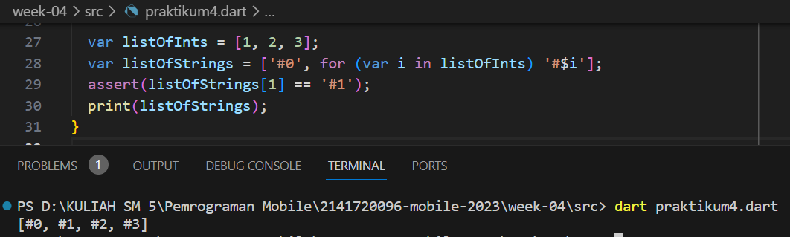

## TUGAS PRAKTIKUM 
### 1. Silakan selesaikan Praktikum 1 sampai 5, lalu dokumentasikan berupa screenshot hasil pekerjaan Anda beserta penjelasannya!
### Praktikum 1 : Eksperimen Data List
#### Langkah 1
Ketik atau salin kode program berikut ke dalam void main().
()
#### Langkah 2
Silakan coba eksekusi (Run) kode pada langkah 1 tersebut. Apa yang terjadi? Jelaskan!

- Kode pada langkah 1 menghasilkan output seperti diatas yang mengartikan bahwa kode itu mengilustrasikan cara bekerja dengan list, pengujian kondisi menggunakan 'assert'.
#### Langkah 3
Ubah kode pada langkah 1 menjadi variabel final yang mempunyai index = 5 dengan default value = null. Isilah nama dan NIM Anda pada elemen index ke-1 dan ke-2. Lalu print dan capture hasilnya. 

- Kode diatas mengalami eror karena deklarasi list sebagai 'List<int?>' yang artinya hanya berisi nilai tipe integer atau null. Namun saya mengisi elemen dengan tipe data string.  

- Setelah mengganti deklarasi dengan menggunakan 'List<Object?>' yang mengartikan deklarasi ini bisa menggunakan tipe data campuran, maka menghasilkan output yang bisa dilihat pada gambar diatas.
### Praktikum 2 : Eksperimen Data Set
#### Langkah 1
Ketik atau salin kode program berikut ke dalam fungsi main().

#### Langkah 2
Silakan coba eksekusi (Run) kode pada langkah 1 tersebut. Apa yang terjadi? Jelaskan! Lalu perbaiki jika terjadi error.

- Kode diatas tidak terjadi eror. Kode diatas adalah contoh output dari penggunaan set dalam dart yang disana merupakan koleksi elemen unik. Kode diatas berisi nama unsur halogen dan kemudian dicetak lah isi set tersebut ke layar dengan unsur nama halogen.
#### Langkah 3
Tambahkan kode program berikut, lalu coba eksekusi (Run) kode Anda.

Apa yang terjadi ? Jika terjadi error, silakan perbaiki namun tetap menggunakan ketiga variabel tersebut.  
- Sebenarnya tidak menghasilkan eror, namun 'names3' sebenarnya adalah map kosong, bukan set. Jika ingin membuat set maka dipastikan terlebih dahulu untuk menentukan tipe data seperti yang ada di 'names1' dan 'names2'.  

Tambahkan elemen nama dan NIM Anda pada kedua variabel Set tersebut dengan dua fungsi berbeda yaitu .add() dan .addAll(). Untuk variabel Map dihapus, nanti kita coba di praktikum selanjutnya.

### Praktikum 3 : Eksperimen Tipe Data Maps
#### Langkah 1
Ketik atau salin kode program berikut ke dalam fungsi main().

#### Langkah 2
Silakan coba eksekusi (Run) kode pada langkah 1 tersebut. Apa yang terjadi? Jelaskan! Lalu perbaiki jika terjadi error.

- Tidak terjadi eror, dan mengeluarkan output seperti yang sudah diperintahkan dengan print gifts dan nobleGases.
#### Langkah 3
Tambahkan kode program berikut, lalu coba eksekusi (Run) kode Anda.
Apa yang terjadi ? Jika terjadi error, silakan perbaiki.

- Sebenarnya tidak menghasilkan eror, namun karena saya membuat dua map baru yaitu 'mhs1' dan 'mhs2' yang isinya kosong. Lain halnya dengan dua map awal 'gifts' dan 'nobleGases' yang sudah ada isinya dan memiliki pasangan key-value yang sesuai dengan tipe data yang ditentukan  

Tambahkan elemen nama dan NIM Anda pada tiap variabel di atas (gifts, nobleGases, mhs1, dan mhs2). 

### Praktikum 4 : Eksperimen Tipe Data List: Spread dan Control-flow Operators
#### Langkah 1
Ketik atau salin kode program berikut ke dalam fungsi main().

#### Langkah 2
Silakan coba eksekusi (Run) kode pada langkah 1 tersebut. Apa yang terjadi? Jelaskan! Lalu perbaiki jika terjadi error.

- Mengalami eror karena pada sebelumnya tidak ada deklarasi variabel 'list1'. Maka dari itu adanya perbaikan kode dengan mengganti 'list1' dengan 'list' dan menghasilkan output seperti dibawah ini

#### Langkah 3
Tambahkan kode program berikut, lalu coba eksekusi (Run) kode Anda.
Apa yang terjadi ? Jika terjadi error, silakan perbaiki. Tambahkan variabel list berisi NIM Anda menggunakan Spread Operators. Dokumentasikan hasilnya dan buat laporannya!

- Kode diatas terjadi eror saat run, karena terjadinya kesalahan penulisan pada variabel dimana deklarasi variabel 'list1' tetapi mencoba mengakses sebagai 'list1' dalam pernyataan 'list3'. Hal ini menyebabkan eror karena 'list1' tidak dideklarasikan sebelumnya. Untuk perbaikan di kode bawah ini dengan menambahkan variabel var dan nim lalu menghasilkan output dibawah

#### Langkah 4
Tambahkan kode program berikut, lalu coba eksekusi (Run) kode Anda. Apa yang terjadi ? Jika terjadi error, silakan perbaiki. 

- Terjadi eror saat run kode diatas karena variabel promoActive tidak dideklarasikan atau tidak memiliki nilai yang jelas.

Tunjukkan hasilnya jika variabel promoActive ketika true dan false.
- Ketika menggunakan variabel promoActive true

- Ketika menggunakan variabel promoActive false

#### Langkah 5
Tambahkan kode program berikut, lalu coba eksekusi (Run) kode Anda. Apa yang terjadi ? Jika terjadi error, silakan perbaiki. 

- Terjadi eror saat proses run karena tidak ada pendefinisian nama variabel 'login' pada sebelumnya.

Tunjukkan hasilnya jika variabel login mempunyai kondisi lain.

- Pada output yang ditampilkan bisa dijelaskan bahwa elemen 'Inventory' dimasukkan dalam 'nav2' hanya jika nilai variabel 'login' adalah 'Manager'. jika 'login' tidak sama dengan 'Manager', maka 'Inventory' tidak akan dimasukkan dalam nav2
#### Langkah 6
Tambahkan kode program berikut, lalu coba eksekusi (Run) kode Anda.

Apa yang terjadi ? Jika terjadi error, silakan perbaiki. Jelaskan manfaat Collection For dan dokumentasikan hasilnya.
- Tidak terjadi eror karena kode di atas membuat dua daftar: listOfInts yang berisi angka [1, 2, 3], dan listOfStrings yang dibuat dengan ekspresi for-in yang menambahkan tanda '#' di depan setiap elemen dalam listOfInts. Hasilnya adalah listOfStrings yang berisi ['#0', '#1', '#2', '#3']. Pernyataan assert memeriksa apakah elemen ke-1 dalam listOfStrings adalah '#1', yang benar. Akhirnya, hasil dari listOfStrings dicetak menggunakan print. 
- Collection for memungkinkan pembuatan koleksi data secara deklaratif berdasarkan koleksi sumber, menghasilkan kode yang lebih ringkas dan mudah dibaca, serta mempermudah transformasi dan manipulasi data dalam bahasa pemrograman Dart.
### Praktikum 5 : Eksperimen Tipe Data Records
#### Langkah 1
Ketik atau salin kode program berikut ke dalam fungsi main().

#### Langkah 2
Silakan coba eksekusi (Run) kode pada langkah 1 tersebut. Apa yang terjadi? Jelaskan! Lalu perbaiki jika terjadi error.

- Kode diatas mengalami eror saat di run karena tidak ada tanda ; pada akhir kode. Untuk perbaikan bisa dilihat pada kode dibawah ini

#### Langkah 3
Tambahkan kode program berikut di luar scope void main(), lalu coba eksekusi (Run) kode Anda. Apa yang terjadi ? Jika terjadi error, silakan perbaiki. 

- Tidak terjadi eror, namun kode yang ada diluar dari scope void main() tidak dijalankan

Gunakan fungsi tukar() di dalam main() sehingga tampak jelas proses pertukaran value field di dalam Records.

#### Langkah 4
Tambahkan kode program berikut di dalam scope void main(), lalu coba eksekusi (Run) kode Anda.
Apa yang terjadi ? Jika terjadi error, silakan perbaiki. 

- Ketika menjalankan program diatas, maka terjadi eror dikarenakan pemanggilan var mahasiswa yang belum diberikan nilai apapun. Lalu perbaikan dengan pemberian nilai pada variabel mahasiswa sesuai dengan tipe anotasi recordnya yaitu String dan integer

Inisialisasi field nama dan NIM Anda pada variabel record mahasiswa di atas. Dokumentasikan hasilnya dan buat laporannya!

#### Langkah 5
Tambahkan kode program berikut di dalam scope void main(), lalu coba eksekusi (Run) kode Anda.
Apa yang terjadi ? Jika terjadi error, silakan perbaiki. Gantilah salah satu isi record dengan nama dan NIM Anda, lalu dokumentasikan hasilnya dan buat laporannya!

- Tidak terjadi eror ketika melakukan run. Kode tersebut terdaoat pemanggilan atau pengaksesan field dengan sintaks $, dengan mengabaikan field yang mempunyai key atau nama seperti 'first' dipanggil dengan $1, bukan $first.

#### 2. Jelaskan yang dimaksud Functions dalam bahasa Dart!
- Function dalam Dart adalah blok kode yang digunakan untuk mengeksekusi tugas tertentu. Fungsi dapat menerima argumen, menjalankan logika, dan mengembalikan nilai (jika diperlukan). Mereka digunakan untuk mengorganisir kode secara modular, memungkinkan penggunaan ulang, dan membuat kode lebih terstruktur.
#### 3. Jelaskan jenis-jenis parameter di Functions beserta contoh sintaksnya!
- Jenis parameter di Function yaitu :  
a. Positional Optional Parameter (Parameter Opsional Bersyarat) 
Positional Optional Parameter adalah parameter yang tidak harus diberikan saat memanggil fungsi dan bisa diabaikan jika tidak diperlukan

b. Default Value (Parameter Default) 
Parameter Default adalah parameter opsional dengan nilai default yang akan digunakan jika argumen tidak disediakan saat memanggil fungsi

c. Named Parameter (Parameter Opsional Dinamis)  
Parameter ini tidak harus diberikan saat memanggil fungsi, dan bisa menyebutkannya dengan nama saat memanggil fungsi

d. Required Parameter (Parameter Wajib) 
Parameter wajib yang harus diberikan saat memanggil fungsi dan tidak bisa diabaikan

#### 4. Jelaskan maksud Functions sebagai first-class objects beserta contoh sintaknya!
- Functions sebagai first-class object adalah mengacu pada kemampuan untuk memperlakukan fungsi seperti halnya objek lain seperti string, angka, atau objek lainnya. Artinya yaitu dapat mengoperasikan fungsi seperti variabel, menyimpannya dalam variabel, mengirimkannya sebagai argumen ke fungsi lain, mengembalikannya dari fungsi lain, dan sebagainya. Untuk contoh sintaks nya seperti gambar di bawah ini

#### 5. Apa itu Anonymous Functions? Jelaskan dan berikan contohnya!
- Anonymous Function dalam Dart adalah fungsi yang tidak memiliki nama dan sering disebut sebagai lambda atau closure. Fungsi ini sering digunakan untuk membuat kode yang lebih ringkas, dan dapat diberikan kepada variabel atau digunakan dalam berbagai konteks, seperti menambahkannya atau menghapusnya dari koleksi. Fungsi anonim memiliki parameter yang mirip dengan fungsi bernama dan dideklarasikan tanpa nama fungsi. Contoh sintaks bisa dilihat di gambar ini

#### 6. Jelaskan perbedaan Lexical scope dan Lexical closures! Berikan contohnya!
- Perbedaan Lexical Scope dan Lexical Closure 
a. Lexical Scope (Lingkup Lexical): Variabel memiliki ruang lingkup yang ditentukan oleh struktur kode secara statis. Anda bisa melihat di mana variabel berada dengan melihat tata letak kode. 

b. Lexical Closures (Penutupan Lexical): Fungsi dapat mengakses variabel-variabel dalam ruang lingkup sekitarnya, bahkan ketika fungsi tersebut digunakan di luar ruang lingkup aslinya. Fungsi "menutup" (close) variabel-variabel tersebut sehingga tetap dapat diakses.

#### 7. Jelaskan dengan contoh cara membuat return multiple value di Functions! 
- Dalam Dart, kita bisa mengembalikan beberapa nilai dari sebuah fungsi dengan mengemas nilai ke dalam sebuah objek atau tipe data yang sesuai. Salah satu cara yang umum adalah mengembalikan list. Ini adalah kode membuat fungsi yang mengembalikan multiple value menggunakan list
