## ADINDA WAHYU LUCHMANSYAHVIRA (2141720096 / TI - 3H)
# adinda_app
### Langkah 1 : Membuat Project
- Mengganti kode pubspec.yaml

- Mengganti kode analysis_options.yaml

- Mengganti konten file main.dart menjadi seperti gambar dibawah 

### Langkah 2 : Menambahkan Tombol
- Meluncurkan Aplikasi
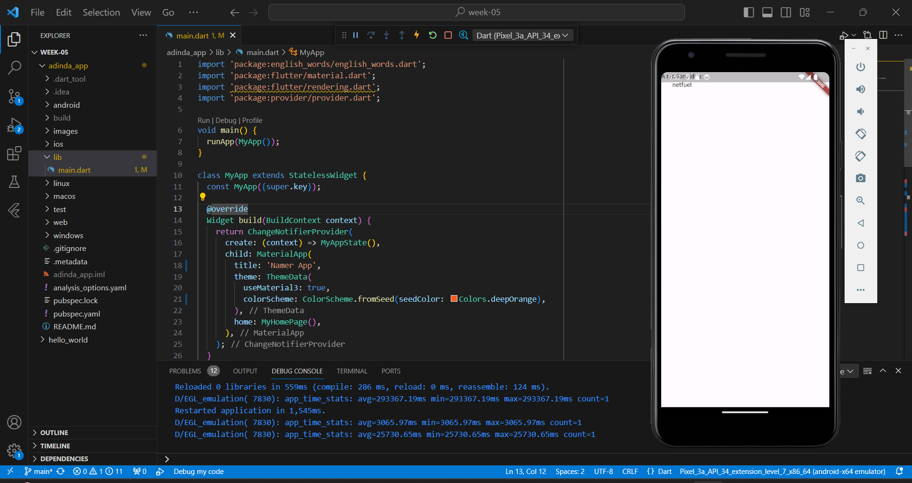

- Hot Reload Pertama
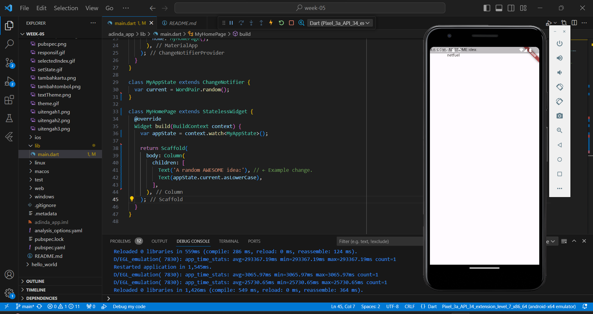

- Menambahkan tombol
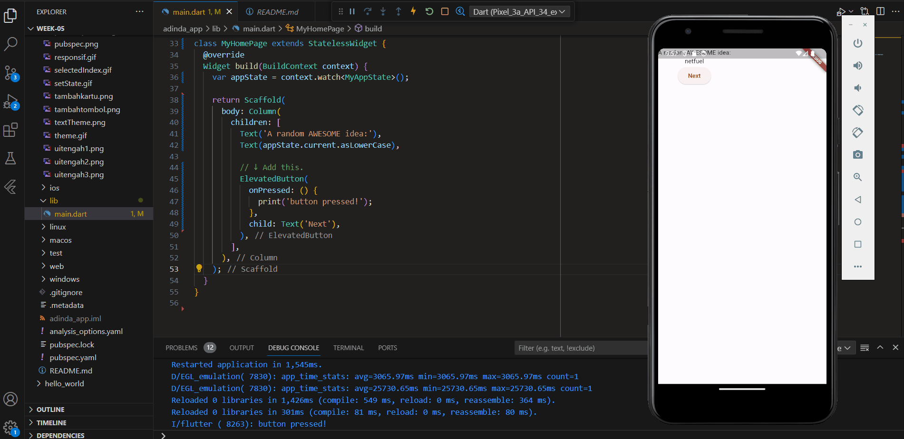

- Perilaku Pertama Anda  
dimana setiap menekan tombol Next maka akan menghasilkan pasangan kata acak yang baru

### Langkah 3 : Memperindah Tampilan Aplikasi
- Mengekstrak Widget
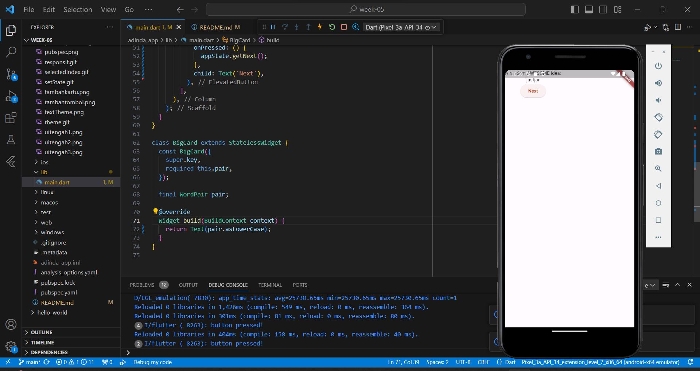

- Menambahkan Kartu
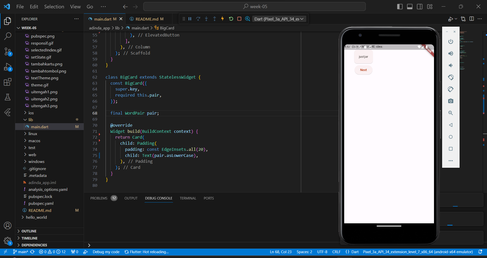

- Tema dan Gaya
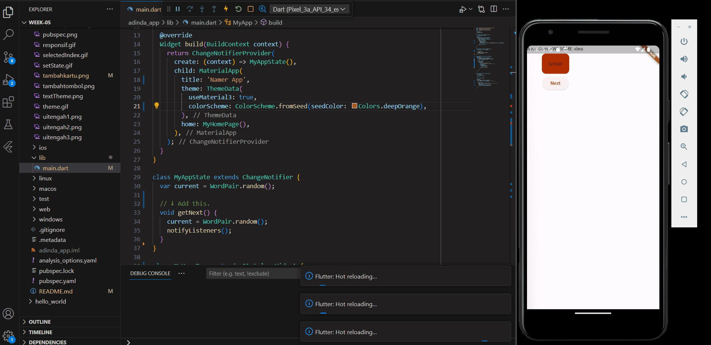

- Text Theme
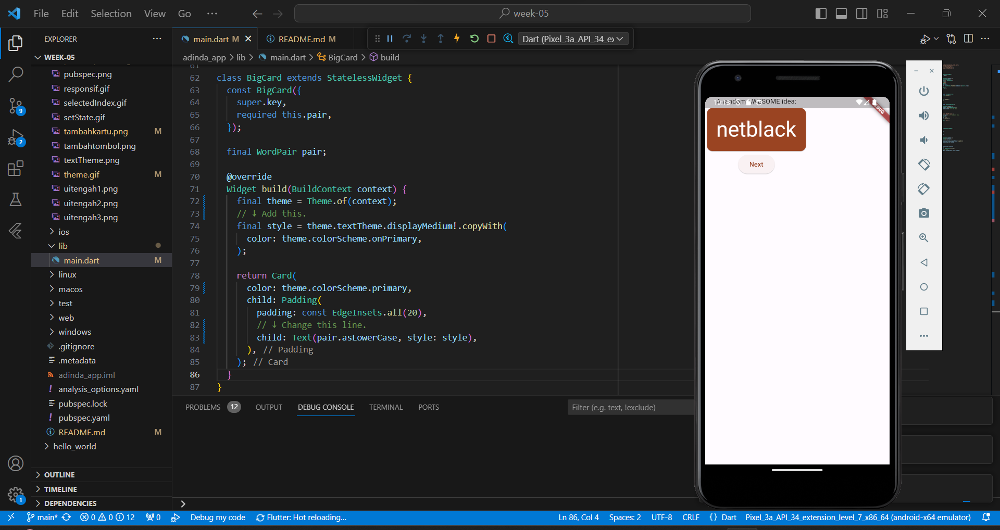

- Meningkatkan Aksesibilitas
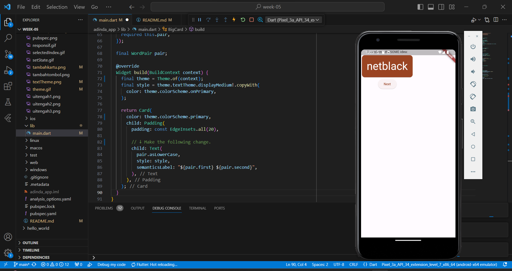

- Menempatkan UI di Tengah
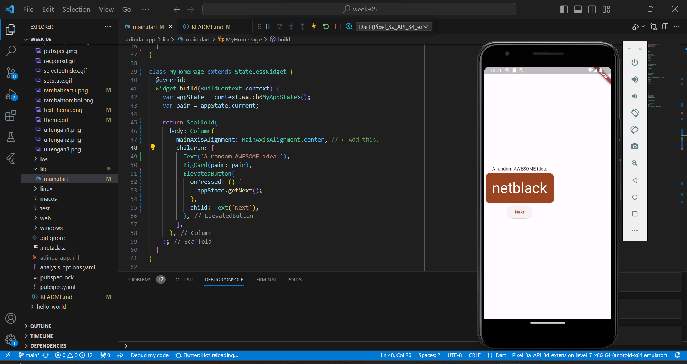

- Wrap with Center
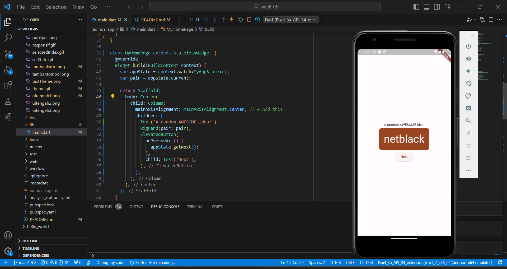

- Menghapus Text diatas BigCard
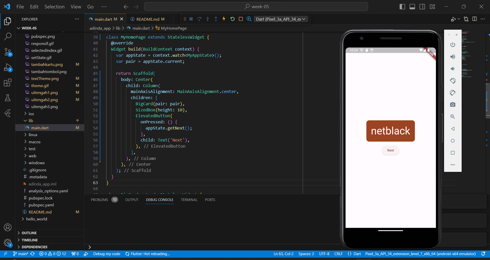

### Langkah 4 : Menambahkan Fungsi
- Menambahkan Logika Bisnis

- Menambahkan Tombol

- ElevatedButton untuk tombol dengan ikon hati

### Langkah 5 : Menambahkan Kolom Samping Navigasi
- Membuat layar terpisah untuk bagian favorit pengguna. Menerapkan StatefulWidget
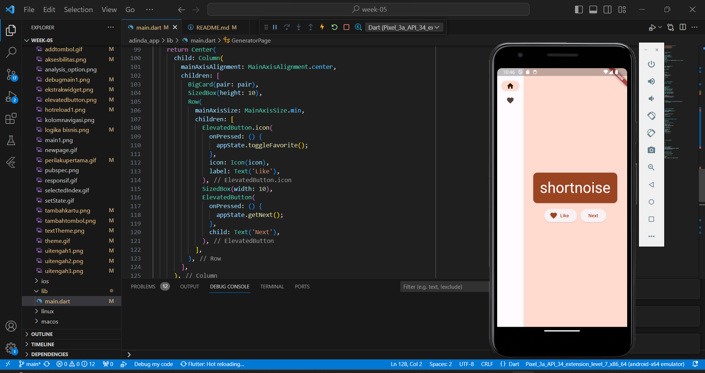

- Widget stateless versus stateful 
setState
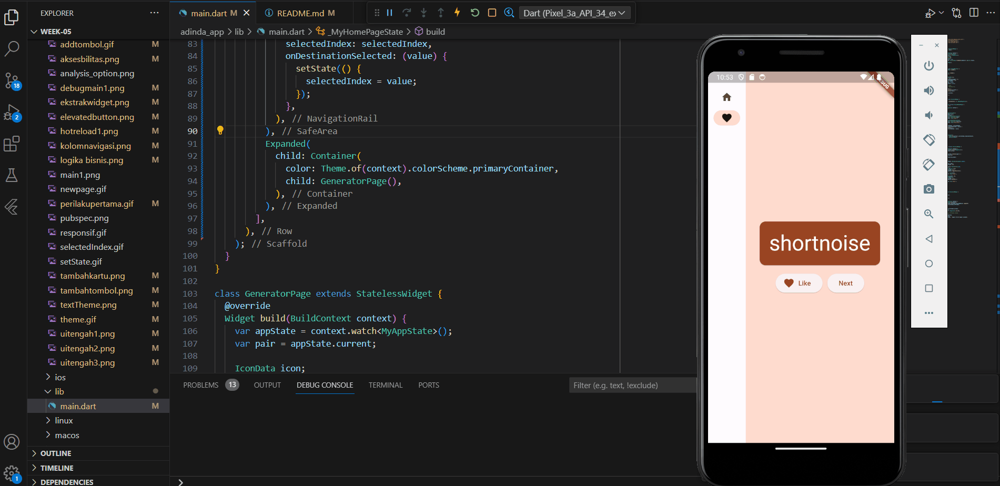 
selectedIndex
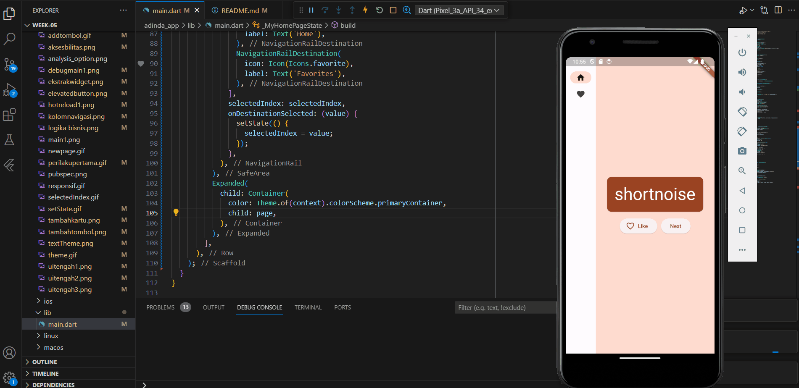

- Tingkat Respon
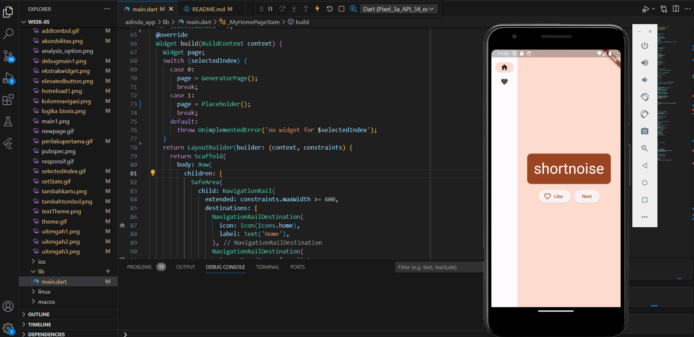

### Langkah 6 : Menambahkan Halaman Baru
- Menampilkan daftar favorites dalam widget stateless baru, FavoritePage, lalu menampilkan widget tersebut bukan Placeholder
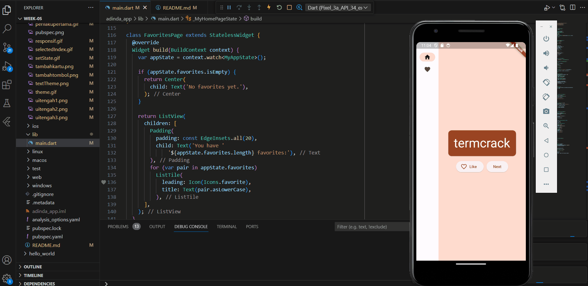

