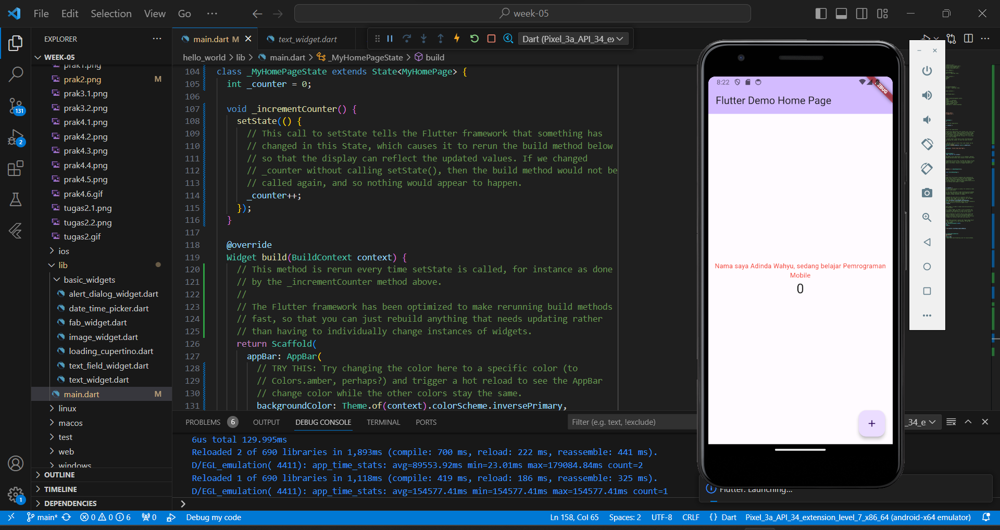
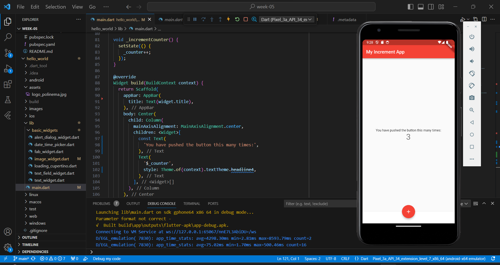
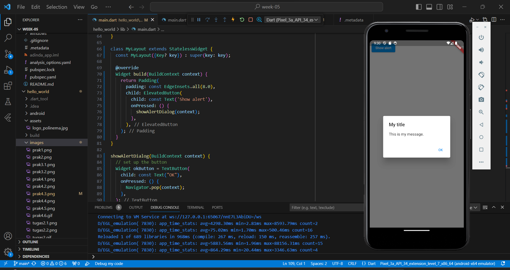
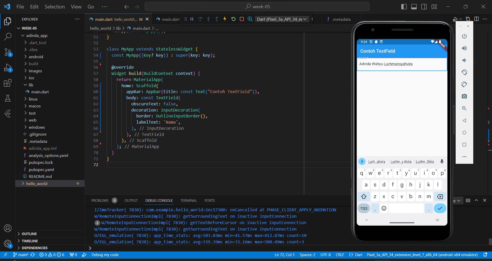

# hello_world
## TUGAS PRAKTIKUM
 
1. Selesaikan Praktikum 1 sampai 4, lalu dokumentasikan dan push ke repository Anda berupa screenshot setiap hasil pekerjaan beserta penjelasannya di file README.md!

### Praktikum 1 : Membuat Project Flutter Baru
Membuat project flutter dengan nama hello_world

### Praktikum 2 : Membuat Repository Github dan Laporan Praktikum
A new Flutter project 

### Praktikum 3 : Menerapkan Widget Dasar
Langkah 1 : Text Widget  
Mengganti text menjadi nama lengkap dengan melakukan import file text_widget.dart ke main dart

Langkah 2 : Image Widget 
Menampilkan logo polinema dengan melakukan import file image_widget.dart ke main.dart 

### Praktikum 4 : Menerapkan Widget Material Design dan iOS Cupertino
Langkah 1 : Cupertino Button dan Loading Bar

Langkah 2 : Floating Action Button (FAB)

Langkah 3 : Scaffold Widget

Langkah 4 : Dialog Widget

Langkah 5 : Input dan Selection Widget

Langkah 6 : Date and Time Pickers

  
 2. Pada praktikum 4 mulai dari Langkah 3 sampai 6, buatlah file widget tersendiri di folder basic_widgets, kemudian pada file main.dart cukup melakukan import widget sesuai masing-masing langkah tersebut!
 - Pembuatan file widget class alert_dialog_widget.dart yang isinya function untuk menampilkan alert
 - Pembuatan file widget class date_time_picker.dart yang isinya function untuk menampikan date and time picker
 - Pembuatan file widget class text_field_widget.dart yang isinya function untuk menampilkan text field
 - Lalu proses import widget class diatas kedalam main.dart

 
 - Selanjutnya memanggil MyTextField, AlertButton, dan MyDateTimePicker pada main.dart
 
 
 - Menghasilkan output seperti dibawah ini
 
 
  
 3. Selesaikan Codelabs: Your first Flutter app, lalu buatlah laporan praktikumnya dan push ke repository GitHub Anda! 
 [Tugas No.3 Ada Disini](https://github.com/adindasyv/2141720096-mobile-2023/tree/main/week-05/adinda_app)

