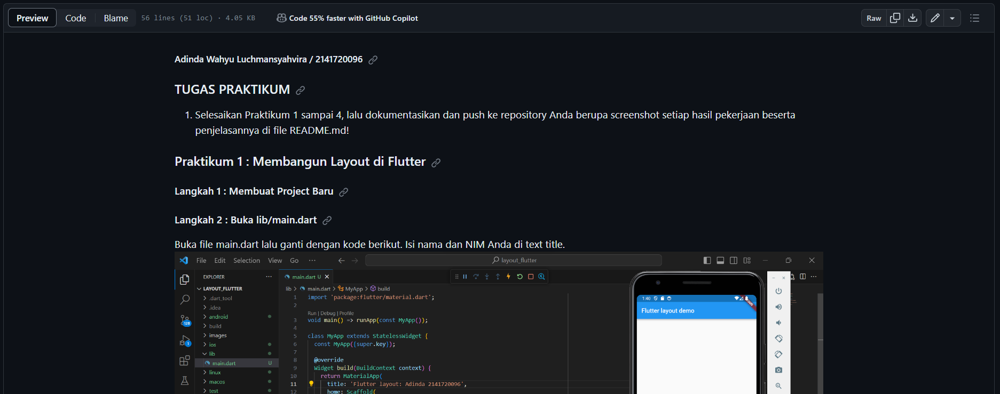
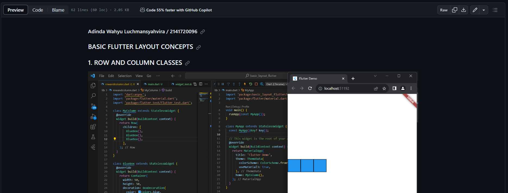

### PENJELASAN TUGAS
1. Untuk penjelasan layout_flutter, bisa dilihat di link dibawah  
[KLIK LINK INI](https://github.com/adindasyv/2141720096-mobile-2023/blob/main/week-07/src/layout_flutter/README.md)

2. Untuk penjelasan basic_layout_flutter, bisa dilihat di link dibawah  
[KLIK LINK INI](https://github.com/adindasyv/2141720096-mobile-2023/blob/main/week-07/src/basic_layout_flutter/README.md)
