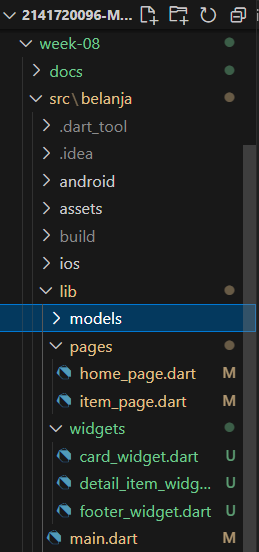

## Praktikum Minggu ke 8 - Navigasi dan Rute
### Praktikum 5 - Membangun Navigasi di Flutter
#### Langkah 1: Siapkan project baru
Sebelum melanjutkan praktikum, terlebih dahulu membuat project baru Flutter dengan nama belanja, dengan membuat susunan folder sebagaimana gambar berikut. Penyusunan ini dimaksudkan untuk mengorganisasi kode dan widget yang lebih mudah.



#### Langkah 2: Mendefinisikan Route pada Class HomePage dan ItemPage Secara Lengkap

1. kode item.dart

```dart
class Item {
  String name, imageUrl;
  int price, stok;
  double rating;

  Item(
      {required this.name,
      required this.price,
      required this.imageUrl,
      required this.stok,
      required this.rating});
}

```

2. kode home_page.dart

```dart
import 'package:belanja/models/item.dart';
import 'package:belanja/widgets/card_widget.dart';
import 'package:belanja/widgets/footer_widget.dart';
import 'package:flutter/material.dart';

class HomePage extends StatelessWidget {
  final List<Item> items = [
    Item(
        name: 'Gula',
        price: 12000,
        imageUrl: '../assets/1.jpg',
        stok: 60,
        rating: 5.0),
    Item(
        name: 'Garam',
        price: 3500,
        imageUrl: '../assets/2.png',
        stok: 50,
        rating: 4.9),
    Item(
        name: 'Minyak Goreng',
        price: 35500,
        imageUrl: '../assets/3.jpg',
        stok: 32,
        rating: 4.5),
    Item(
        name: 'Mie Indomie',
        price: 2300,
        imageUrl: '../assets/4.jpg',
        stok: 80,
        rating: 4.8),
    Item(
        name: 'Teh Celup',
        price: 11490,
        imageUrl: '../assets/5.png',
        stok: 21,
        rating: 4.6),
    Item(
        name: 'Beras',
        price: 69500,
        imageUrl: '../assets/6.jpg',
        stok: 20,
        rating: 5.0),
    Item(
        name: 'Kopi Kapal Api',
        price: 15700,
        imageUrl: '../assets/7.jpg',
        stok: 25,
        rating: 4.6),
    Item(
        name: 'Energen',
        price: 24200,
        imageUrl: '../assets/8.jpg',
        stok: 12,
        rating: 4.9),
  ];

  @override
  Widget build(BuildContext context) {
    return Scaffold(
      appBar: AppBar(
        title: const Text('Shopping List'),
      ),
      body: GridView.builder(
        gridDelegate: const SliverGridDelegateWithFixedCrossAxisCount(
          crossAxisCount: 2,
          childAspectRatio: 0.75,
        ),
        itemCount: items.length,
        itemBuilder: (context, index) {
          final item = items[index];
          return CardWidget(item: item);
        },
      ),
      bottomNavigationBar: FooterWidget(
          name: 'Adinda Wahyu Luchmansyahvira',
          nim: '2141720096'),
    );
  }
}


```
3. kode item_page.dart

```dart
import 'package:belanja/models/item.dart';
import 'package:belanja/widgets/detail_item_widget.dart';
import 'package:flutter/material.dart';

class ItemPage extends StatelessWidget {
  const ItemPage({Key? key}) : super(key: key);

  @override
  Widget build(BuildContext context) {
    final itemArgs = ModalRoute.of(context)!.settings.arguments as Item;

    return Scaffold(
      appBar: AppBar(
        title: const Text('Item Details'),
      ),
      body: SingleChildScrollView(
        padding: const EdgeInsets.all(16),
        child: DetailItemWidget(item: itemArgs),
      ),
    );
  }
}

```

#### Langkah 3: Membuat Widget
1. kode card_widget.dart

```dart
import 'package:belanja/models/item.dart';
import 'package:flutter/material.dart';

class CardWidget extends StatelessWidget {
  final Item item;

  const CardWidget({required this.item, Key? key}) : super(key: key);

  @override
  Widget build(BuildContext context) {
    return InkWell(
      onTap: () {
        Navigator.pushNamed(context, '/item', arguments: item);
      },
      child: Card(
        child: Padding(
          padding: const EdgeInsets.all(8),
          child: Column(
            crossAxisAlignment: CrossAxisAlignment.start,
            children: [
              Hero(
                tag: 'productImage${item.name}',
                child: AspectRatio(
                  aspectRatio: 1,
                  child: Image.asset(item.imageUrl, fit: BoxFit.cover),
                ),
              ),
              Row(
                mainAxisAlignment: MainAxisAlignment.spaceBetween,
                children: [
                  Padding(
                    padding: const EdgeInsets.only(top: 8),
                    child: Text(
                      item.name,
                      style: const TextStyle(
                        fontWeight: FontWeight.bold,
                        fontSize: 16,
                      ),
                    ),
                  ),
                  Row(
                    children: [
                      const Icon(
                        Icons.star,
                        color: Colors.orange,
                        size: 20,
                      ),
                      Text(
                        item.rating.toString(),
                        style: const TextStyle(
                          color: Colors.orange,
                          fontSize: 14,
                        ),
                      ),
                    ],
                  ),
                ],
              ),
              Text(
                'Rp. ${item.price}',
                style: const TextStyle(
                  color: Colors.redAccent,
                  fontSize: 14,
                ),
              ),
              Padding(
                padding: const EdgeInsets.symmetric(vertical: 8),
                child: Text(
                  'Stok: ${item.stok}',
                  style: const TextStyle(
                    color: Colors.grey,
                    fontSize: 14,
                  ),
                ),
              ),
            ],
          ),
        ),
      ),
    );
  }
}

```

2. kode detail_item_widget.dart

```dart
import 'package:belanja/models/item.dart';
import 'package:flutter/material.dart';

class DetailItemWidget extends StatelessWidget {
  final Item item;

  const DetailItemWidget({required this.item, Key? key}) : super(key: key);

  @override
  Widget build(BuildContext context) {
    return Column(
      crossAxisAlignment: CrossAxisAlignment.start,
      children: [
        Hero(
          tag: 'productImage${item.name}',
          child: AspectRatio(
            aspectRatio: 1.5,
            child: Image.asset(item.imageUrl),
          ),
        ),
        const SizedBox(height: 16),
        Text(
          '${item.name}',
          style: const TextStyle(
            fontWeight: FontWeight.bold,
            fontSize: 24,
          ),
        ),
        const SizedBox(height: 8),
        Row(
          mainAxisAlignment: MainAxisAlignment.spaceBetween,
          children: [
            Text(
              'Rp. ${item.price}',
              style: const TextStyle(
                color: Colors.deepOrange,
                fontSize: 20,
              ),
            ),
            Row(
              children: [
                const Icon(
                  Icons.star,
                  color: Colors.orange,
                  size: 20,
                ),
                Text(
                  item.rating.toString(),
                  style: const TextStyle(
                    color: Colors.orange,
                    fontSize: 16,
                  ),
                ),
              ],
            ),
          ],
        ),
        const SizedBox(height: 8),
        Text(
          'Stok: ${item.stok}',
          style: const TextStyle(
            color: Colors.grey,
            fontSize: 16,
          ),
        ),
      ],
    );
  }
}

```

3. footer_widget.dart

```dart
import 'package:flutter/material.dart';

class FooterWidget extends StatelessWidget {
  final String name;
  final String nim;

  FooterWidget({required this.name, required this.nim});

  @override
  Widget build(BuildContext context) {
    return ClipRRect(
      borderRadius: BorderRadius.only(
        topLeft: Radius.circular(15),
        topRight: Radius.circular(15),
      ),
      child: BottomAppBar(
        child: Container(
          padding: const EdgeInsets.all(16),
          decoration: BoxDecoration(
            color: Color.fromARGB(255, 139, 191, 229),
          ),
          child: Row(
            mainAxisAlignment: MainAxisAlignment.spaceBetween,
            children: [
              Text(
                name,
                style: TextStyle(
                  color: Colors.white,
                  fontSize: 16,
                ),
              ),
              Text(
                nim,
                style: TextStyle(
                  color: Colors.white,
                  fontSize: 16,
                ),
              ),
            ],
          ),
        ),
      ),
    );
  }
}

void main() {
  runApp(MaterialApp(
    home: Scaffold(
      appBar: AppBar(
        title: Text('Footer Widget Example'),
      ),
      body: Center(
        child: Text('Body Content'),
      ),
      bottomNavigationBar: FooterWidget(
        name: 'Adinda Wahyu Luchmansyahvira',
        nim: '2141720096',
      ),
    ),
  ));
}

```

#### Langkah 4: Lengkapi Kode di main.dart
1. kode main.dart

```dart
import 'package:belanja/pages/home_page.dart';
import 'package:belanja/pages/item_page.dart';
import 'package:flutter/material.dart';

void main() {
  runApp(const MyApp());
}

class MyApp extends StatelessWidget {
  const MyApp({super.key});

  @override
  Widget build(BuildContext context) {
    return MaterialApp(
      initialRoute: '/',
      routes: {
        '/': (context) => HomePage(),
        '/item': (context) => const ItemPage(),
      },
    );
  }
}


```

### Hasil Akhir
