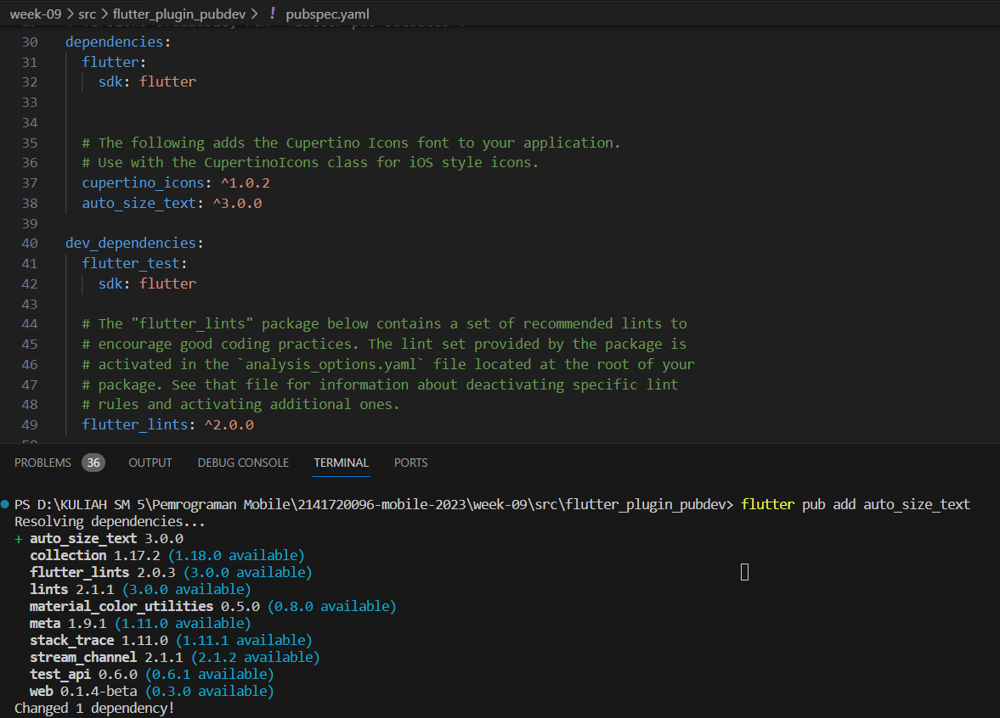
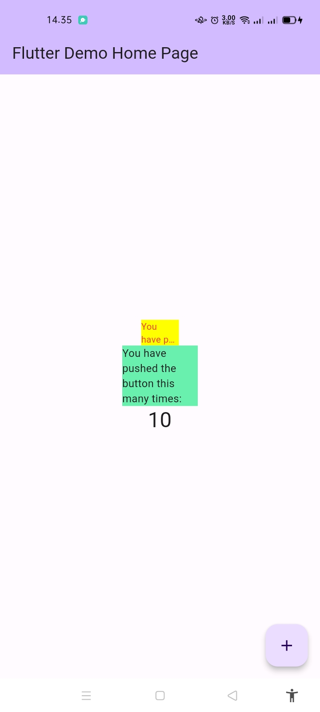

# Praktikum Minggu ke 10 - Manajemen Plugin
## 1. Selesaikan Praktikum tersebut, lalu dokumentasikan dan push ke repository Anda berupa screenshot hasil pekerjaan beserta penjelasannya di file README.md!

### Langkah 2 - Menambahkan Plugin


### Langkah 3 & 4 - Buat file red_text_widget.dart dan Menambah Widget AutoSizeText

- Terjadi error dikarenakan variabel 'text' tidak didefinisikan di dalam widget. Dan kode tidak menerima teks sebagai parameter, hal ini tentu saja menyebabkan error. Untuk perbaikannya ada dalam kode file dibawah ini: 

#### file red_text_widget.dart
```dart
import 'package:auto_size_text/auto_size_text.dart';
import 'package:flutter/material.dart';

class RedTextWidget extends StatelessWidget {
  final String text; // Tambahkan variabel text

  const RedTextWidget({Key? key, required this.text})
      : super(key: key); // Terima teks sebagai parameter

  @override
  Widget build(BuildContext context) {
    return AutoSizeText(
      text,
      style: const TextStyle(color: Colors.red, fontSize: 14),
      maxLines: 2,
      overflow: TextOverflow.ellipsis,
    );
  }
}
```

### Langkah 5 - Menambahkan Widget di main.dart
#### file main.dart
```dart
import 'package:flutter/material.dart';
import 'package:flutter_plugin_pubdev/widget/red_text_widget.dart';

void main() {
  runApp(const MyApp());
}

class MyApp extends StatelessWidget {
  const MyApp({super.key});

  // This widget is the root of your application.
  @override
  Widget build(BuildContext context) {
    return MaterialApp(
      title: 'Flutter Demo',
      debugShowCheckedModeBanner: false,
      theme: ThemeData(
        colorScheme: ColorScheme.fromSeed(seedColor: Colors.deepPurple),
        useMaterial3: true,
      ),
      home: const MyHomePage(title: 'Flutter Demo Home Page'),
    );
  }
}

class MyHomePage extends StatefulWidget {
  const MyHomePage({super.key, required this.title});

  final String title;

  @override
  State<MyHomePage> createState() => _MyHomePageState();
}

class _MyHomePageState extends State<MyHomePage> {
  int _counter = 0;

  void _incrementCounter() {
    setState(() {
      _counter++;
    });
  }

  @override
  Widget build(BuildContext context) {
    return Scaffold(
      appBar: AppBar(
        backgroundColor: Theme.of(context).colorScheme.inversePrimary,
        title: Text(widget.title),
      ),
      body: Center(
        child: Column(
          mainAxisAlignment: MainAxisAlignment.center,
          children: <Widget>[
            Container(
              color: Colors.yellowAccent,
              width: 50,
              child: const RedTextWidget(
                text: 'You have pushed the button this many times:',
              ),
            ),
            Container(
              color: Colors.greenAccent,
              width: 100,
              child: const Text(
                'You have pushed the button this many times:',
              ),
            ),
            Text(
              '$_counter',
              style: Theme.of(context).textTheme.headlineMedium,
            ),
          ],
        ),
      ),
      floatingActionButton: FloatingActionButton(
        onPressed: _incrementCounter,
        tooltip: 'Increment',
        child: const Icon(Icons.add),
      ), // This trailing comma makes auto-formatting nicer for build methods.
    );
  }
}
```

## Hasil Running



## 2. Jelaskan maksud dari langkah 2 pada praktikum tersebut!

- Langkah 2 mengartikan bahwa menambahkan dependensi auto_size_text ke dalam proyek yang sedang kita kerjakan. Perintah **flutter pub add** digunakan untuk menambahkan plugin ke proyek. Ketika menjalankan perintah **```flutter pub add auto_size_text```** di terminal, maka secara otomatis akan mendownload dan mengintegrasikan plugin auto_size_text ke dalam proyek kita.

## 3. Jelaskan maksud dari langkah 5 pada praktikum tersebut!

- **```final String text;```** adalah deklarasi variabel yang digunakan untuk menyimpan teks dalam widget, diperlukan saat membuat instance **RedTextWidget**.
Kemudian konstruktor **```RedTextWidget```** menerima parameter key untuk identifikasi widget dan text (wajib diisi) untuk menampilkan teks dalam widget tersebut.

## 4. Pada langkah 6 terdapat dua widget yang ditambahkan, jelaskan fungsi dan perbedaannya!

- Widget pertama adalah Container dengan instance dari **RedTextWidget** di dalamnya, menampilkan teks merah dengan penyesuaian ukuran otomatis. Container ini memiliki latar belakang kuning (Colors.yellowAccent) dan lebar 50 piksel.
- Widget kedua adalah Container dengan child berupa instance dari widget Text. Container ini memiliki latar belakang hijau (Colors.greenAccent) dan lebar 100 piksel.

Perbedaan antara kedua widget tersebut terletak pada pengaturan teks yang ditampilkan. Widget pertama memiliki pengaturan kustom seperti style, maxline, dan overflow, sementara widget kedua tidak diatur secara eksplisit, menghasilkan tampilan default dari widget Text().

## 5. Jelaskan maksud dari tiap parameter yang ada di dalam plugin auto_size_text berdasarkan tautan pada dokumentasi [ini](https://pub.dev/documentation/auto_size_text/latest/) !

- Parameter text adalah teks yang ditampilkan dalam widget AutoSizeText dan diukur serta diatur ukuran fontnya secara otomatis.
- Parameter style mengatur gaya teks, seperti warna (red) dan ukuran font (14).
- Parameter maxLines menentukan jumlah maksimum baris teks; diatur sebagai 2, teks akan muncul dalam maksimal 2 baris. Jika lebih, ditampilkan dengan elipsis (...).
- Parameter overflow mengontrol perilaku teks ketika melebihi maxLines. Misalnya, dengan TextOverflow.ellipsis, teks yang tidak muat akan muncul dengan elipsis.