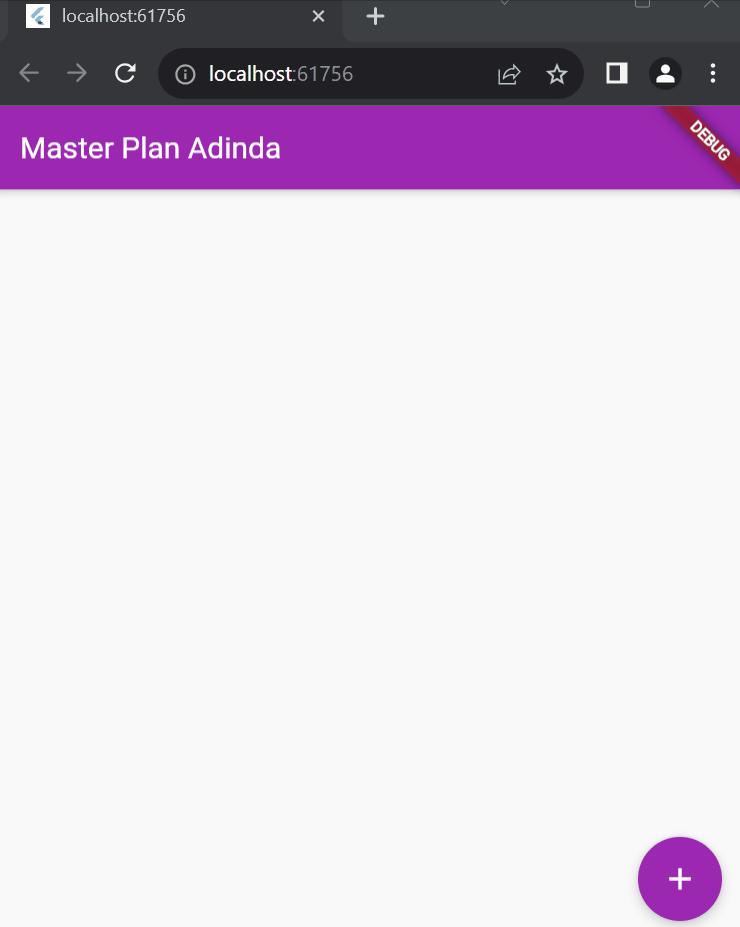
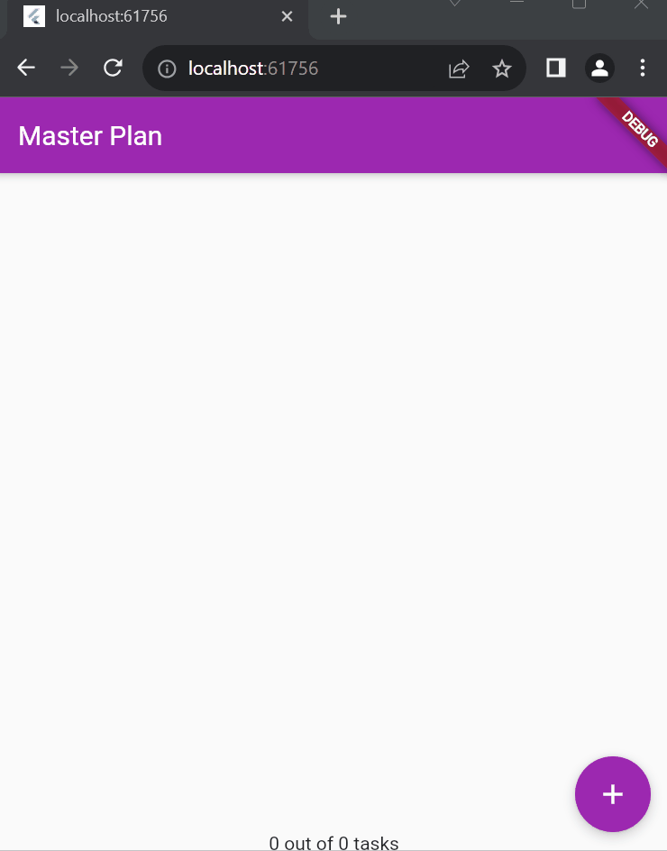
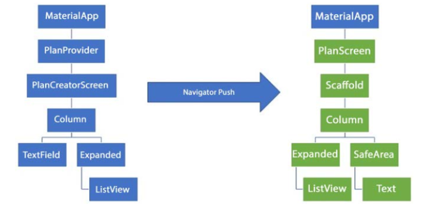
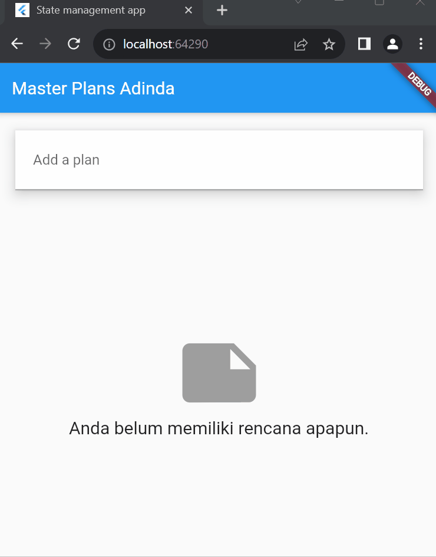

# Praktikum Minggu-11 : Dasar State Management
### Praktikum 1 : Dasar State dengan Model-View
### Tugas Praktikum 1
1. Selesaikan langkah-langkah praktikum tersebut, lalu dokumentasikan berupa GIF hasil akhir praktikum beserta penjelasannya di file README.md! Jika Anda menemukan ada yang error atau tidak berjalan dengan baik, silakan diperbaiki.
2. Jelaskan maksud dari langkah 4 pada praktikum tersebut! Mengapa dilakukan demikian?
- export **'plan.dart';** Ini mengatakan bahwa berkas saat ini (tempat pernyataan ini dituliskan) akan mengekspor (export) semua definisi (class, fungsi, variabel, dll.) yang ada dalam berkas plan.dart. Sedangkan export **'task.dart';** Hal yang sama berlaku untuk berkas task.dart. Ini memungkinkan berkas saat ini untuk mengekspor semua definisi dari task.dart
3. Mengapa perlu variabel plan di langkah 6 pada praktikum tersebut? Mengapa dibuat konstanta ?
- Dalam langkah 6 pada praktikum tersebut, **Plan plan = const Plan();** digunakan untuk membuat objek dari kelas Plan dan menginisialisasinya dengan nilai konstan menggunakan kata kunci const. Pemilihan konstanta (const) untuk variabel plan dilakukan untuk memberikan nilai default pada awalnya dan memastikan bahwa objek plan selalu ada dengan nilai tetap yang sama selama masa hidup widget ini.
4. Lakukan capture hasil dari Langkah 9 berupa GIF, kemudian jelaskan apa yang telah Anda buat!
- Membuat aplikasi flutter bernama **Master Plan Adinda**. Dimana aplikasi ini mempunyai model data tugas dan rencana. Tampilan utama juga menggunakan ListView.builder untuk menampilkan daftar tugas dan juga user dapat menambahkan tugas baru dan juga bisa melakukan check pada checkbox untuk menandai tugas sudah berhasil. 

5. Apa kegunaan method pada Langkah 11 dan 13 dalam lifecyle state ?
- Langkah 11 - **initState**  
Pada Langkah 11, method initState digunakan untuk melakukan inisialisasi saat stateful widget pertama kali dibuat, objek ScrollController diciptakan dan diatur untuk mendengarkan perubahan. Ketika pengguna menggulir, metode ini memastikan bahwa fokus dihapus (menggunakan FocusScope.of(context).requestFocus(FocusNode())). Ini biasanya digunakan untuk menghindari masalah fokus keyboard yang mungkin terjadi 
- Langkah 13 - **dispose**  
Dipanggil saat stateful widget dihapus. Bertanggung jawab untuk membersihkan atau membebaskan sumber daya, seperti menghapus objek ScrollController dengan dispose(). Ini penting untuk mencegah kebocoran memori atau masalah sumber daya lainnya. dispose dipanggil sebelum widget dihapus.
### Praktikum 2 : InheritedWidget
### Tugas Praktikum 2
1. Selesaikan langkah-langkah praktikum tersebut, lalu dokumentasikan berupa GIF hasil akhir praktikum beserta penjelasannya di file README.md! Jika Anda menemukan ada yang error atau tidak berjalan dengan baik, silakan diperbaiki sesuai dengan tujuan aplikasi tersebut dibuat.
2. Jelaskan mana yang dimaksud InheritedWidget pada langkah 1 tersebut! Mengapa yang digunakan InheritedNotifier?
- Pada langkah 1, InheritedNotifier dan InheritedWidget digunakan untuk menyediakan dan mendengarkan perubahan pada **ValueNotifierPlan** ke dalam pohon widget. ValueNotifier digunakan untuk memonitor perubahan pada objek Plan, dan InheritedNotifier menyederhanakan logika pembaruan widget ketika terjadi perubahan pada nilai ValueNotifier. Ini membuat manajemen keadaan menjadi lebih efisien dan otomatis.
3. Jelaskan maksud dari method di langkah 3 pada praktikum tersebut! Mengapa dilakukan demikian?
- Method memiliki dua tujuan utama :  
a. completedCount: Menghitung jumlah tugas yang telah selesai (complete). Method ini menggunakan ekspresi lambda dan fungsi where untuk menyaring tugas-tugas yang telah selesai, dan kemudian menggunakan fungsi length untuk menghitung jumlahnya.  
b. completenessMessage: Membuat pesan yang menyatakan seberapa banyak tugas yang telah selesai dari total jumlah tugas. Ini memanfaatkan nilai yang dihitung sebelumnya dengan completedCount dan menggabungkannya dengan total jumlah tugas.
4. Lakukan capture hasil dari Langkah 9 berupa GIF, kemudian jelaskan apa yang telah Anda buat!
- Pada aplikasi Flutter memiliki manajemen state yang menggunakan InheritedNotifier. Tampilan PlanScreen, progress rencana ditampilkan secara jelas di bagian bawah dan pembaruan UI yang otomatis merespons perubahan pada data rencana yang dikelola oleh ValueNotifier

### Praktikum 3 : State di Multiple Screens
### Tugas Praktikum 3
1. Selesaikan langkah-langkah praktikum tersebut, lalu dokumentasikan berupa GIF hasil akhir praktikum beserta penjelasannya di file README.md! Jika Anda menemukan ada yang error atau tidak berjalan dengan baik, silakan diperbaiki sesuai dengan tujuan aplikasi tersebut dibuat.
2. Berdasarkan Praktikum 3 yang telah Anda lakukan, jelaskan maksud dari gambar diagram berikut ini!

- Sebelah kiri: Pengguna membuat rencana di PlanCreatorScreen dengan PlanProvider mengelola data dan tampilan. Column menata vertikal dengan TextField dan Expanded.  
Sebelah kanan: Setelah navigasi, pengguna melihat daftar rencana di PlanScreen. PlanProvider di root memastikan akses lintas tampilan. Column, Expanded, dan SafeArea mengatur optimal, termasuk ListView. Ada juga Text yang mungkin menampilkan pesan. Navigasi terjadi antara langkah-langkah pembuatan rencana dan melihat rencana. Ini menunjukkan manajemen data efektif dan tata letak yang responsif.
3. Lakukan capture hasil dari Langkah 14 berupa GIF, kemudian jelaskan apa yang telah Anda buat!
- Setelah Praktikum 3, "Master Plan" dapat mengelola dan menampilkan daftar rencana melalui PlanProvider. Modifikasi pada PlanProvider, main.dart, dan plan_screen.dart memungkinkan manajemen state yang terpusat. Pengguna dapat dinamis mengelola rencana dengan penambahan PlanCreatorScreen. Ini meningkatkan fleksibilitas dan responsivitas aplikasi.
