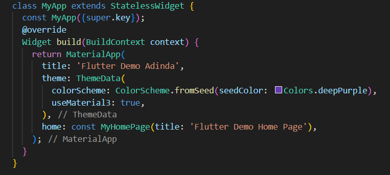
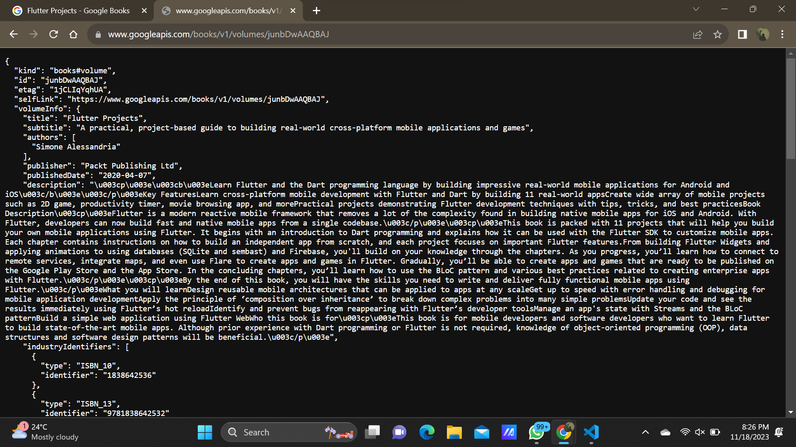
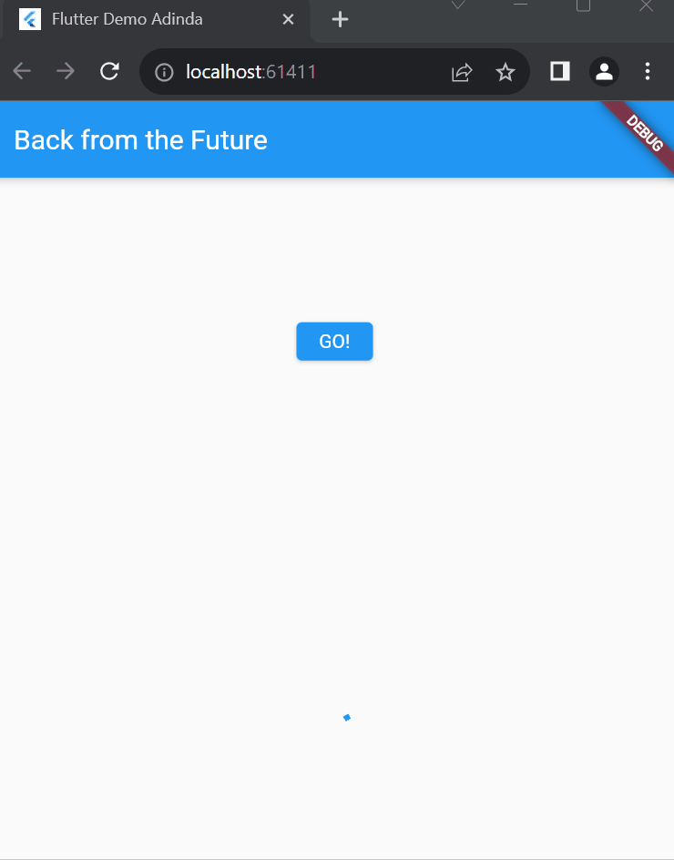
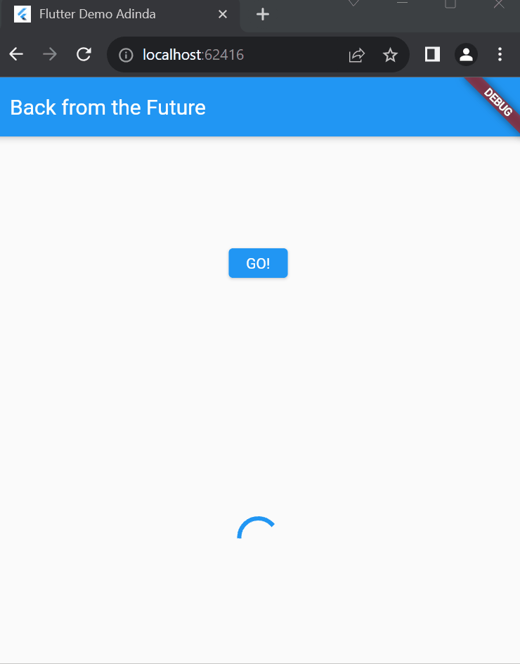
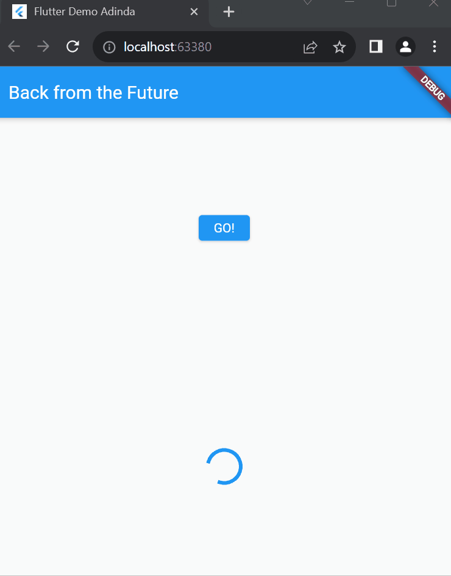
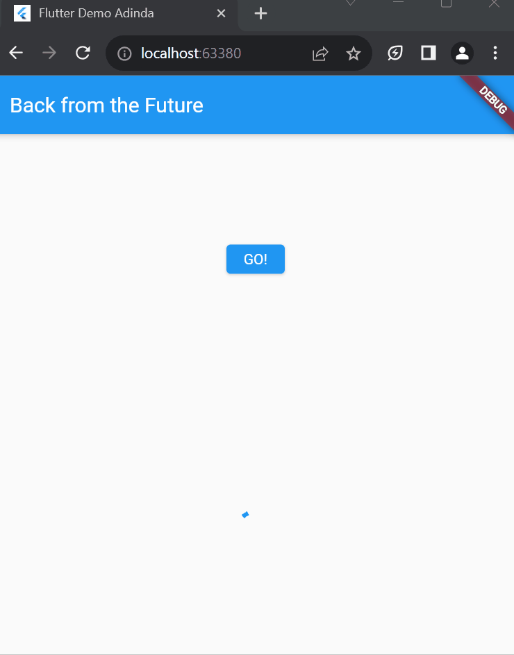
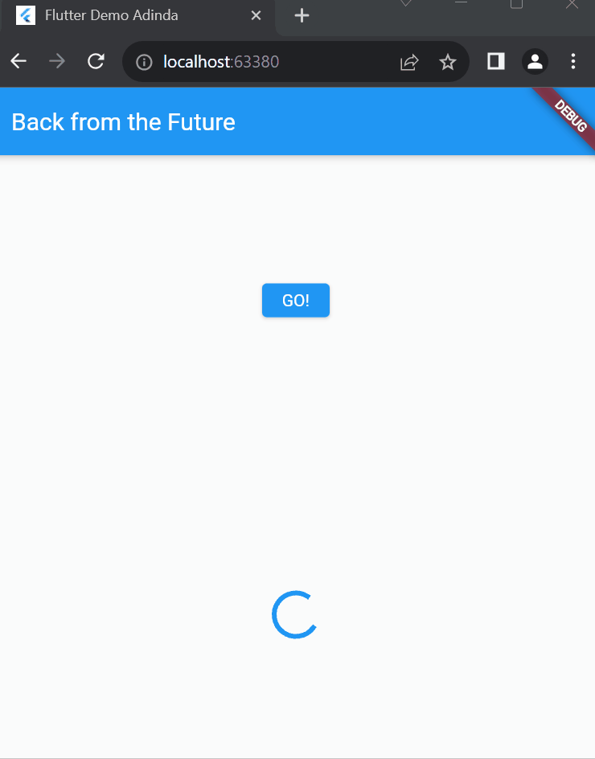
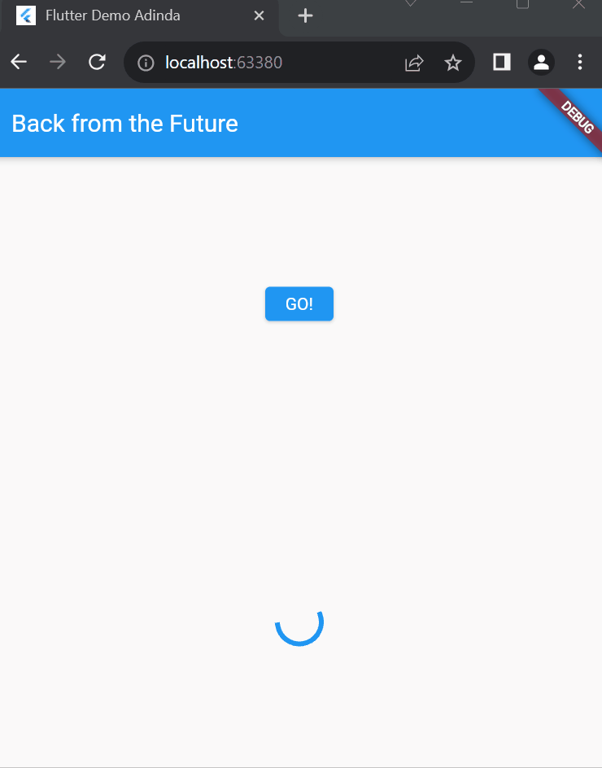

# Praktikum Minggu 12 - Pemrograman Asynchronous
## Praktikum 1 - Mengunduh Data dari Web Service (API)
### Soal 1
Tambahkan nama panggilan Anda pada title app sebagai identitas hasil pekerjaan Anda.

### Soal 2
- Carilah judul buku favorit Anda di Google Books, lalu ganti ID buku pada variabel path di kode tersebut. Caranya ambil di URL browser Anda seperti gambar berikut ini.

- Kemudian cobalah akses di browser URI tersebut dengan lengkap seperti ini. Jika menampilkan data JSON, maka Anda telah berhasil. Lakukan capture milik Anda dan tulis di README pada laporan praktikum. Lalu lakukan commit dengan pesan "W12: Soal 2".

### Soal 3
- Jelaskan maksud kode langkah 5 tersebut terkait substring dan catchError!  
1. substring digunakan pada objek String untuk ambil potongan dari string tersebut. **substring(0, 450)** digunakan untuk mengambil karakter dari indeks 0 sampai indeks ke 449. Jadi string tersebut akan mengambil 450 karakter yang dimulai dari 0 dari respon HTTP yang didapat.
2. Pada kode tersebut, catchError digunakan untuk menangkap kesalahan yang mungkin terjadi saat menjalankan **fungsi getData()**. Secara singkat, blok catchError ini akan dijalankan jika terjadi kesalahan selama permintaan data.
- Capture hasil praktikum Anda berupa GIF dan lampirkan di README. Lalu lakukan commit dengan pesan "W12: Soal 3".

## Praktikum 2 - Menggunakan await/async untuk menghindari callbacks
### Soal 4
- Jelaskan maksud kode langkah 1 dan 2 tersebut!  
1. kode 1 menjelaskan tentang tiga fungsi asynchronous **(returnOneAsync, returnTwoAsync, dan returnThreeAsync)** mengembalikan nilai int setelah menunggu selama 3 detik masing-masing. Fungsi-fungsi ini memanfaatkan async dan await untuk melakukan operasi penundaan tanpa memblokir eksekusi program secara keseluruhan.
2. kode 2 menjelaskan tentang fungsi count yang menjalankan tiga fungsi lainnya secara berurutan menggunakan await. Fungsi-fungsi tersebut (returnOneAsync, returnTwoAsync, returnThreeAsync) mengembalikan nilai setelah penundaan selama 3 detik masing-masing. Nilai-nilai ini ditambahkan ke variabel total, dan hasilnya diubah menjadi string sebelum diberikan kepada variabel result. Terakhir, setState dipanggil untuk memperbarui tampilan dengan nilai hasil yang baru.
- Capture hasil praktikum Anda berupa GIF dan lampirkan di README. Lalu lakukan commit dengan pesan "W12: Soal 4".

## Praktikum 3 - Menggunakan Completer di Future
### Soal 5
- Jelaskan maksud kode langkah 2 tersebut!  
Kode menggunakan Completer untuk menciptakan objek Future, memungkinkan penundaan eksekusi melalui calculate dengan menunggu 5 detik. Fungsi getNumber membuat Completer<int>, memanggil calculate, dan mengembalikan objek future untuk akses hasil perhitungan asynchronous di masa depan. Setelah penundaan selesai, calculate menyelesaikan completer dengan nilai 42, menandakan bahwa tugas telah selesai.
- Capture hasil praktikum Anda berupa GIF dan lampirkan di README. Lalu lakukan commit dengan pesan "W12: Soal 5".

### Soal 6
- Jelaskan maksud perbedaan kode langkah 2 dengan langkah 5-6 tersebut!  
Pada langkah 5-6 menggunakan blok try-catch dalam fungsi calculate, sehingga jika ada kesalahan selama penundaan, completer.completeError({}) akan dipanggil untuk menandai penyelesaian dengan kesalahan.
Sementara itu, langkah 2 tidak memiliki blok try-catch dalam fungsi calculate, sehingga tidak menangani secara khusus kesalahan yang mungkin terjadi selama penundaan.
- Capture hasil praktikum Anda berupa GIF dan lampirkan di README. Lalu lakukan commit dengan pesan "W12: Soal 6".

## Praktikum 4 - Memanggil Future secara paralel
### Soal 7
- Capture hasil praktikum Anda berupa GIF dan lampirkan di README. Lalu lakukan commit dengan pesan "W12: Soal 7".

### Soal 8
- Jelaskan maksud perbedaan kode langkah 1 dan 4! 
Langkah 1 menggunakan pustaka eksternal yang berasal dari async dengan FutureGroup. Ini memungkinkan untuk menambahkan beberapa Future ke dalam grup dan menunggu penyelesaian grup tersebut menggunakan futureGroup.future. Kemudian, melakukan perhitungan terhadap nilai yang dikembalikan oleh Future yang ada dalam grup.  
Langkah 4, di sisi lain, menggunakan Future.wait, suatu fungsi bawaan Dart yang menunggu sejumlah Future untuk menyelesaikan dan kemudian mengembalikan List hasil. Ini memungkinkan menunggu beberapa Future sekaligus tanpa perlu menggunakan pustaka eksternal.
## Praktikum 7 - Menangani Respon Error pada Async Code
### Soal 9
- Capture hasil praktikum Anda berupa GIF dan lampirkan di README. Lalu lakukan commit dengan pesan "W12: Soal 9".
