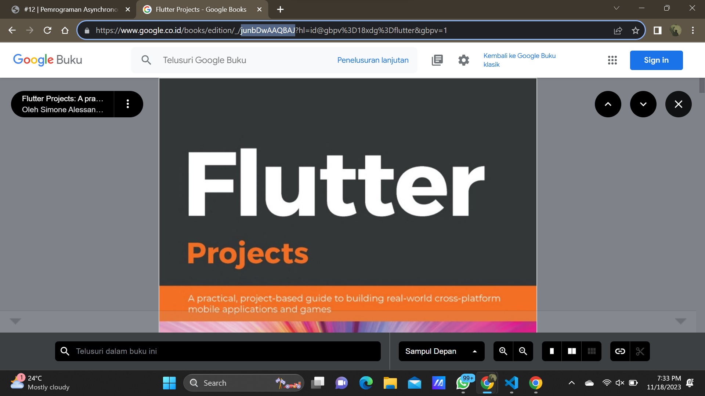

# Praktikum Minggu 12 - Pemrograman Asynchronous
## Praktikum 1 - Mengunduh Data dari Web Service (API)
### Soal 1
Tambahkan nama panggilan Anda pada title app sebagai identitas hasil pekerjaan Anda.

### Soal 2
- Carilah judul buku favorit Anda di Google Books, lalu ganti ID buku pada variabel path di kode tersebut. Caranya ambil di URL browser Anda seperti gambar berikut ini.

- Kemudian cobalah akses di browser URI tersebut dengan lengkap seperti ini. Jika menampilkan data JSON, maka Anda telah berhasil. Lakukan capture milik Anda dan tulis di README pada laporan praktikum. Lalu lakukan commit dengan pesan "W12: Soal 2".

### Soal 3
- Jelaskan maksud kode langkah 5 tersebut terkait substring dan catchError!  
1. substring digunakan pada objek String untuk ambil potongan dari string tersebut. **substring(0, 450)** digunakan untuk mengambil karakter dari indeks 0 sampai indeks ke 449. Jadi string tersebut akan mengambil 450 karakter yang dimulai dari 0 dari respon HTTP yang didapat.
2. Pada kode tersebut, catchError digunakan untuk menangkap kesalahan yang mungkin terjadi saat menjalankan **fungsi getData()**. Secara singkat, blok catchError ini akan dijalankan jika terjadi kesalahan selama permintaan data.
- Capture hasil praktikum Anda berupa GIF dan lampirkan di README. Lalu lakukan commit dengan pesan "W12: Soal 3".
