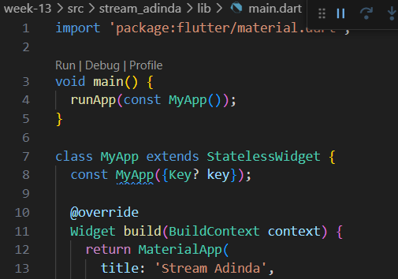
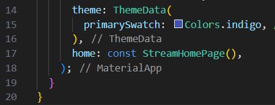
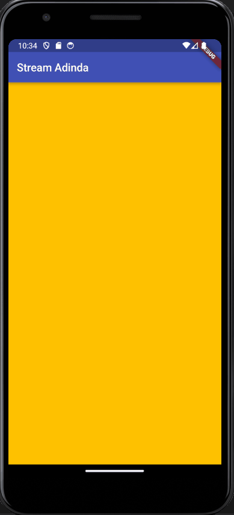
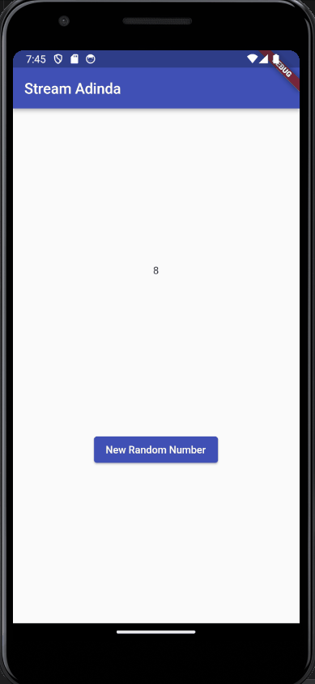

# Pertemuan Minggu 13 - Lanjutan State dengan Streams
## Praktikum 1 - Dart Streams
### Soal 1
- Tambahkan nama panggilan Anda pada title app sebagai identitas hasil pekerjaan Anda.

- Gantilah warna tema aplikasi sesuai kesukaan Anda.

- Lakukan commit hasil jawaban Soal 1 dengan pesan "W13: Jawaban Soal 1"
### Soal 2
- Tambahkan 5 warna lainnya sesuai keinginan Anda pada variabel colors tersebut. 

- Lakukan commit hasil jawaban Soal 2 dengan pesan "W13: Jawaban Soal 2"
### Soal 3 
- Jelaskan fungsi keyword yield* pada kode tersebut!  
fungsi yields* adalah untuk mengirimkan nilai-nilai dari stream yang dihasilkan oleh ekspresi di sebelah kanan. Dengan kata lain, setiap fungsi ini dipanggil, akan mengirimkan warna dari stream yang dihasilkan oleh **Stream.periodic**
- Apa maksud isi perintah kode tersebut?  
Penjelasan mengenai kode adalah  kode tersebut membuat sebuah stream yang menghasilkan warna dari daftar warna setiap detik. yield* digunakan untuk mengirimkan nilai-nilai dari stream yang dihasilkan oleh **Stream.periodic.** Tujuan akhirnya adalah menghasilkan suatu stream yang terus-menerus mengeluarkan warna-warna yang ada dalam daftar colors.
- Lakukan commit hasil jawaban Soal 3 dengan pesan "W13: Jawaban Soal 3"
### Soal 4
- Capture hasil praktikum Anda berupa GIF dan lampirkan di README.  

- Lakukan commit hasil jawaban Soal 4 dengan pesan "W13: Jawaban Soal 4"
### Soal 5
- Jelaskan perbedaan menggunakan listen dan await for (langkah 9) !  
1. **await for**cdigunakan dalam fungsi yang diawasi oleh async. Hal ini memungkinkan pengguna untuk melakukan iterasi secara langsung melalui setiap elemen baru sebelum melanjutkan ke elemen berikutnya. Cocok digunakan dalam blok fungsi yang sifatnya async dan digunakan dalam fungsi yang dijelaskan dengan async*
2. **listen** digunakan untuk diluar konteks fungsi yang dijelaskan dengan async. Metode listen adalah metode pada objek stream yang memungkinkan untuk mendaftarkan fungsi callback yang akan dipanggil setiap kali ada data yang tersedia di dalam stream.  
Jadi, jika ingin melakukan iterasi secara langsung dan menggunakan await di dalam fungsi yang diawasi, gunakan **await for**. Jika Anda hanya perlu mendengarkan perubahan stream dan menjalankan fungsi callback ketika ada data baru, Anda dapat menggunakan **listen**.
- Lakukan commit hasil jawaban Soal 5 dengan pesan "W13: Jawaban Soal 5"
## Praktikum 2 - Stream Controllers dan Sinks
### Soal 6
- Jelaskan maksud kode langkah 8 dan 10 tersebut! 
1. Langkah 8 adalah ketika menginisialisasi objek NumberStream, mengambil controller stream, dan mendengarkan perubahan pada stream angka. Setiap kali ada perubahan, nilai terakhir (lastNumber) dalam state diperbarui menggunakan setState().
2. Langkah 10 adalah fungsi addRandomNumber membuat objek Random untuk menghasilkan angka acak antara 0 dan 9. Nilai acak tersebut kemudian ditambahkan ke dalam stream menggunakan metode addNumberToSink pada objek numberStream.
- Capture hasil praktikum Anda berupa GIF dan lampirkan di README.

- Lalu lakukan commit dengan pesan "W13: Jawaban Soal 6".