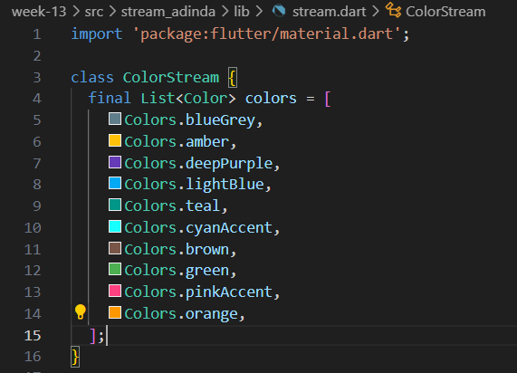

# Pertemuan Minggu 13 - Lanjutan State dengan Streams
## Praktikum 1 - Dart Streams
### Soal 1
- Tambahkan nama panggilan Anda pada title app sebagai identitas hasil pekerjaan Anda.

- Gantilah warna tema aplikasi sesuai kesukaan Anda.

- Lakukan commit hasil jawaban Soal 1 dengan pesan "W13: Jawaban Soal 1"
### Soal 2
- Tambahkan 5 warna lainnya sesuai keinginan Anda pada variabel colors tersebut. 

- Lakukan commit hasil jawaban Soal 2 dengan pesan "W13: Jawaban Soal 2"
### Soal 3 
- Jelaskan fungsi keyword yield* pada kode tersebut!  
fungsi yields* adalah untuk mengirimkan nilai-nilai dari stream yang dihasilkan oleh ekspresi di sebelah kanan. Dengan kata lain, setiap fungsi ini dipanggil, akan mengirimkan warna dari stream yang dihasilkan oleh **Stream.periodic**
- Apa maksud isi perintah kode tersebut?  
Penjelasan mengenai kode adalah  kode tersebut membuat sebuah stream yang menghasilkan warna dari daftar warna setiap detik. yield* digunakan untuk mengirimkan nilai-nilai dari stream yang dihasilkan oleh **Stream.periodic.** Tujuan akhirnya adalah menghasilkan suatu stream yang terus-menerus mengeluarkan warna-warna yang ada dalam daftar colors.
- Lakukan commit hasil jawaban Soal 3 dengan pesan "W13: Jawaban Soal 3"
### Soal 4
- Capture hasil praktikum Anda berupa GIF dan lampirkan di README.  

- Lakukan commit hasil jawaban Soal 4 dengan pesan "W13: Jawaban Soal 4"